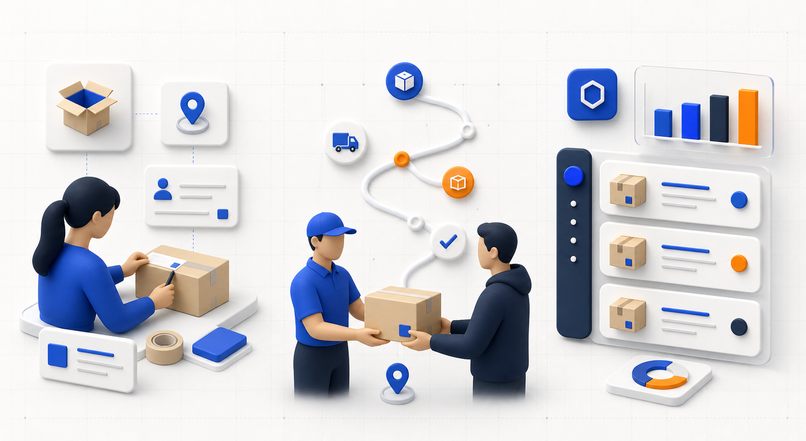
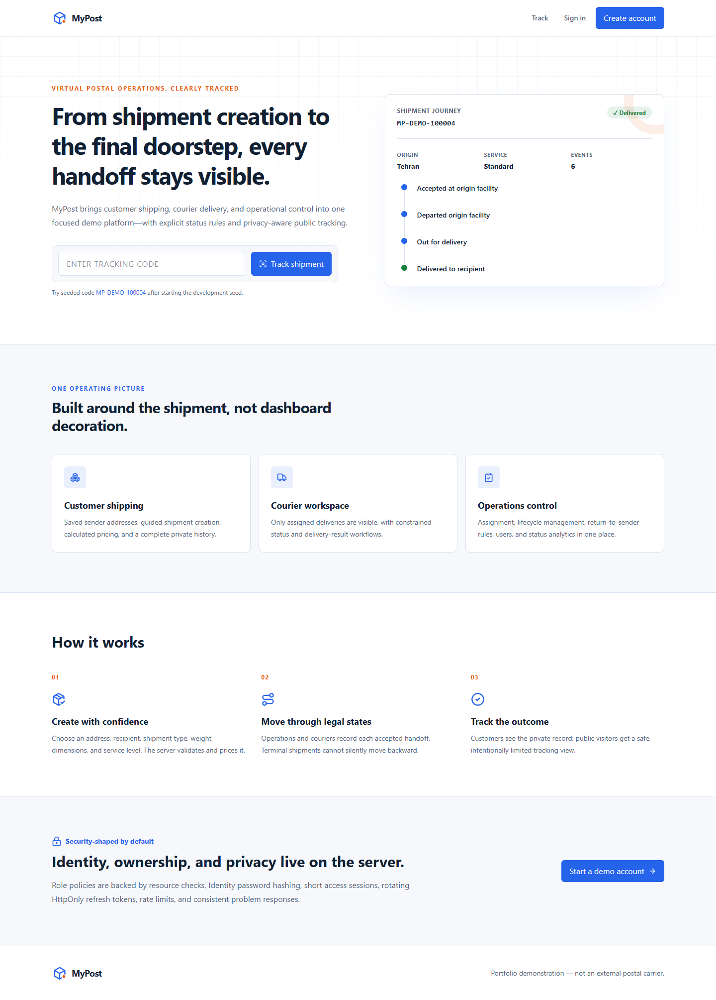
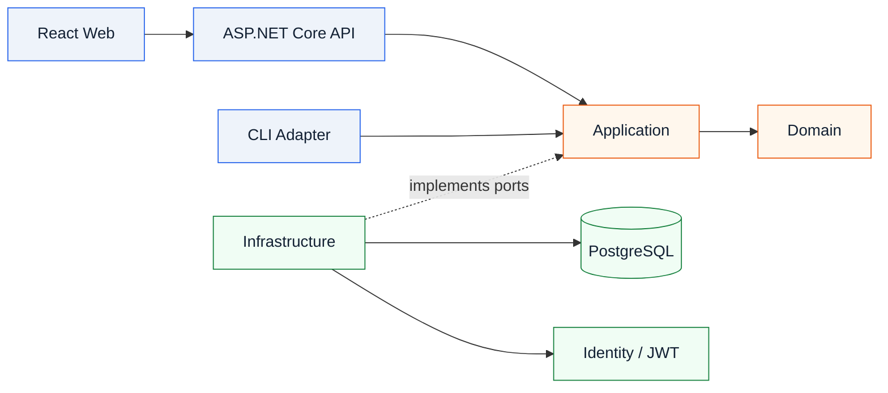
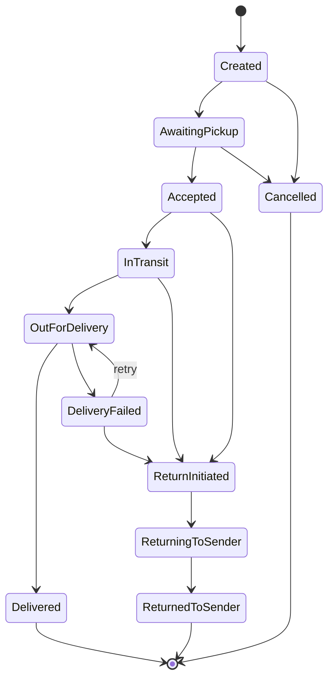

<div align="center">

# MyPost

### Virtual postal operations, from first mile to final handoff

A portfolio-grade shipment platform with role-aware workflows, explicit lifecycle rules,
privacy-safe public tracking, and a production-minded full-stack architecture.

[](https://dotnet.microsoft.com/)
[](https://react.dev/)
[](https://www.typescriptlang.org/)
[](https://www.postgresql.org/)
[](https://docs.docker.com/compose/)

<br />


<sub>Original MyPost artwork generated for this repository.</sub>

</div>

> [!IMPORTANT]
> MyPost is a virtual demonstration product. Tracking events, couriers, and seeded
> records are simulated; the project does not represent a real carrier or live vehicle location.

## Table of contents

- [Why MyPost](#why-mypost)
- [Product tour](#product-tour)
- [Capabilities](#capabilities)
- [Architecture](#architecture)
- [Technology](#technology)
- [Quick start](#quick-start)
- [Demo data](#demo-data)
- [Native development](#native-development)
- [Quality checks](#quality-checks)
- [Security model](#security-model)
- [Project structure](#project-structure)
- [Documentation](#documentation)
- [Current boundaries](#current-boundaries)

## Why MyPost

MyPost models the operational truth behind parcel delivery instead of stopping at a
decorative dashboard. Every status change is validated by the domain, every private
screen is scoped to the signed-in role, and public tracking deliberately exposes only
the information a recipient needs.

| Experience | What it delivers |
|---|---|
| **Public tracking** | Search by tracking code and follow a privacy-safe shipment timeline without signing in. |
| **Customer workspace** | Manage sender addresses, create priced shipments, review history, and cancel eligible parcels. |
| **Courier workspace** | See assigned deliveries only and record constrained pickup, transit, delivery, or failure outcomes. |
| **Operations console** | Assign couriers, control lifecycle exceptions, search users and shipments, and inspect analytics. |
| **CLI adapter** | Track seeded shipments through the same application and persistence boundaries as the API. |

<div align="center">
  
  <p><sub>Original role-workspace concept artwork — customer preparation, courier handoff, and operational control.</sub></p>
</div>

## Product tour

<div align="center">
  
  <p><sub>Actual public experience — responsive landing page, tracking entry, product capabilities, and security positioning.</sub></p>
</div>

The interface is built around a restrained Swiss-inspired system: strong alignment,
semantic status color, visible route motifs, accessible state handling, and responsive
layouts verified at 375, 768, 1024, and 1440 pixels.

## Capabilities

### Shipment operations

- Guided shipment creation with saved sender addresses and immutable address snapshots
- Server-side price calculation by parcel type, weight, dimensions, and service level
- Explicit legal transitions, terminal states, idempotent retries, and complete tracking history
- Courier assignment, failed-delivery recovery, and return-to-sender workflows
- Searchable and paginated shipment views with URL-owned filters
- Persisted status analytics with an accessible textual equivalent to every chart

### Platform engineering

- Versioned Minimal API with OpenAPI, health checks, rate limiting, CORS, and Problem Details
- ASP.NET Core Identity with role policies and resource-level ownership checks
- Short-lived JWT access tokens plus rotating HttpOnly refresh cookies
- PostgreSQL persistence through EF Core migrations and optimistic concurrency
- Lazy-loaded React routes, TanStack Query remote state, React Hook Form, and Zod validation
- Responsive light/dark UI with reduced-motion support and explicit loading, empty, error, and success states

## Architecture

MyPost is a modular monolith. Dependencies point inward, keeping business rules independent
from HTTP, databases, frameworks, and delivery mechanisms.



### Shipment lifecycle



`Shipment` is the consistency boundary for status, assignment, delivery, and return
operations. Repeating the current status or assigning the same active courier is an
idempotent no-op and does not create duplicate history.

## Technology

| Layer | Stack |
|---|---|
| **Backend** | .NET 10, ASP.NET Core Minimal APIs, EF Core 10, Npgsql |
| **Frontend** | React 19, TypeScript 6, Vite 8, Tailwind CSS 4 |
| **State & forms** | TanStack Query, React Hook Form, Zod |
| **UI & data** | Radix UI, Lucide, Recharts |
| **Identity & security** | ASP.NET Core Identity, JWT bearer authentication, rotating refresh tokens |
| **Database** | PostgreSQL 17 |
| **Testing** | MSTest, Vitest, Testing Library, Playwright |
| **Delivery** | Docker Compose, multi-stage images, Nginx |

## Quick start

### Docker Compose — recommended

**Prerequisite:** Docker Desktop with the Linux engine running.

```powershell
Copy-Item .env.example .env
docker compose up --build
```

| Service | URL |
|---|---|
| Web application | <http://localhost:5173> |
| API health | <http://localhost:8080/health> |
| Swagger UI | <http://localhost:8080/swagger> |

Compose waits for PostgreSQL, applies the committed migration, and seeds demo data before
the web service becomes available.

```powershell
# Stop the stack and preserve the database volume
docker compose down

# Remove the local database as well — destructive
docker compose down --volumes
```

> [!WARNING]
> `.env.example` contains local-development defaults. Replace every secret before sharing
> or deploying an environment.

## Demo data

When development seeding is enabled, all accounts use the password configured through
`SEED_PASSWORD` or `Seed__Password`.

| Role | Email | Starting route |
|---|---|---|
| Administrator | `admin@mypost.local` | `/admin` |
| Courier | `courier@mypost.local` | `/courier` |
| Customer | `customer@mypost.local` | `/customer` |
| Customer | `customer2@mypost.local` | `/customer` |

Use `MP-DEMO-100001` through `MP-DEMO-100006` to explore public tracking across
multiple lifecycle states.

## Native development

**Prerequisites:** .NET SDK 10, Node.js 24+, npm, and PostgreSQL 17.

### 1. Start the API

Create the database, then provide secrets through environment variables rather than
committing them:

```powershell
$env:ConnectionStrings__MyPost = 'Host=localhost;Port=5432;Database=mypost;Username=mypost;Password=choose-a-password'
$env:Jwt__SigningKey = 'choose-a-long-random-signing-key-at-least-32-characters'
$env:Seed__Password = 'choose-a-development-demo-password'
dotnet run --project apps/MyPost.Api
```

The development profile listens on `http://localhost:8080`, applies migrations, and
enables seeding only when `Seed__Password` is present.

### 2. Start the web app

```powershell
Set-Location apps/MyPost.Web
npm ci
npm run dev
```

Vite serves the client at `http://localhost:5173` and targets
`http://localhost:8080/api/v1` by default. Set `VITE_API_URL` to override it.

### 3. Use the CLI

```powershell
dotnet run --project apps/MyPost.Cli -- track MP-DEMO-100001
```

The CLI resolves the same application services and database configuration as the API;
it does not duplicate domain or persistence behavior.

### Database migrations

```powershell
dotnet tool restore
dotnet ef database update --project src/MyPost.Infrastructure

# Create a future migration
dotnet ef migrations add MeaningfulName --project src/MyPost.Infrastructure
```

## Quality checks

### Backend

```powershell
dotnet restore MyPost.sln
dotnet build MyPost.sln --no-restore
dotnet test MyPost.sln --no-build --no-restore
```

### Frontend

```powershell
Set-Location apps/MyPost.Web
npm ci
npm run typecheck
npm run lint
npm test
npm run build
npm run test:e2e
```

| Test layer | Focus |
|---|---|
| Domain tests | Shipment invariants and legal lifecycle transitions |
| Application tests | Authorized use cases, ownership, pricing, and idempotency |
| Integration tests | Critical API boundaries and privacy-safe responses |
| Component tests | Status, timeline, route protection, and page-state behavior |
| Browser tests | Responsive public experience and shipment-creation flow |

## Security model

- Access tokens are short-lived and retained only in browser memory.
- Refresh tokens are rotated, stored as SHA-256 hashes, and transported in HttpOnly same-site cookies.
- Role policies protect customer, courier, and administrator routes; application services also enforce ownership.
- Public tracking excludes sender identity, phone numbers, street addresses, courier identity, delivery notes, and assignment data.
- Authentication and public tracking use separate rate-limit policies.
- API failures follow Problem Details, include a trace ID, and do not expose stack traces.
- No production secret is stored in the repository.

## Project structure

```text
mypost-csharp-advanced/
├── apps/
│   ├── MyPost.Api/             # Versioned HTTP API and transport concerns
│   ├── MyPost.Cli/             # Thin public-tracking adapter
│   └── MyPost.Web/             # React role experiences
├── src/
│   ├── MyPost.Domain/          # Aggregates, value objects, and invariants
│   ├── MyPost.Application/     # Use cases, DTOs, pricing, and ports
│   └── MyPost.Infrastructure/  # EF Core, PostgreSQL, Identity, and JWT
├── tests/                      # Domain, application, and integration suites
├── docs/                       # Architecture, API, design system, and assets
├── docker-compose.yml
└── MyPost.sln
```

## Documentation

- [Architecture overview](docs/architecture/overview.md)
- [Architecture decisions](docs/architecture/decisions.md)
- [Shipment lifecycle](docs/architecture/shipment-lifecycle.md)
- [Legacy migration map](docs/architecture/legacy-migration.md)
- [API conventions](docs/api/conventions.md)
- [Design system](docs/design-system/master.md)

## Current boundaries

- MyPost is a virtual workflow with no carrier, map, payment, notification, or live vehicle integration.
- Analytics are operational summaries over the application database, not a warehouse pipeline.
- Docker Compose targets local evaluation. Production still requires managed secrets, TLS,
  backups, observability, and a deployment-specific migration strategy.
- Browser E2E tests mock API responses for deterministic UI coverage; server boundary tests
  run separately against an in-memory provider.

---

<div align="center">
  <strong>MyPost</strong> — built to make every virtual handoff explicit, testable, and visible.
</div>
